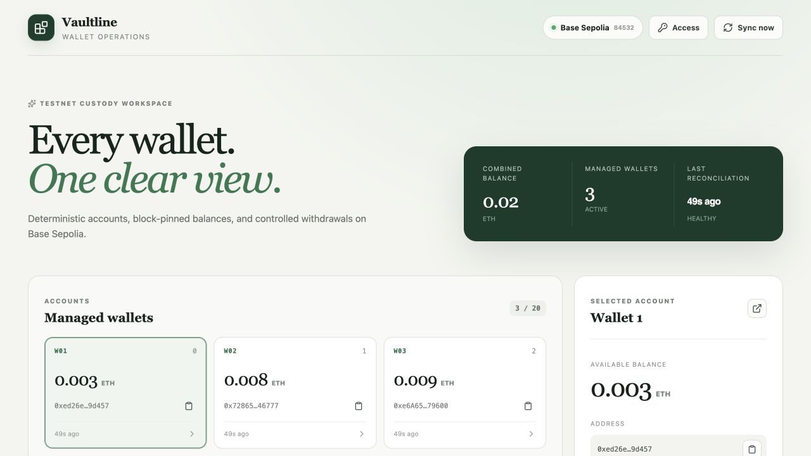
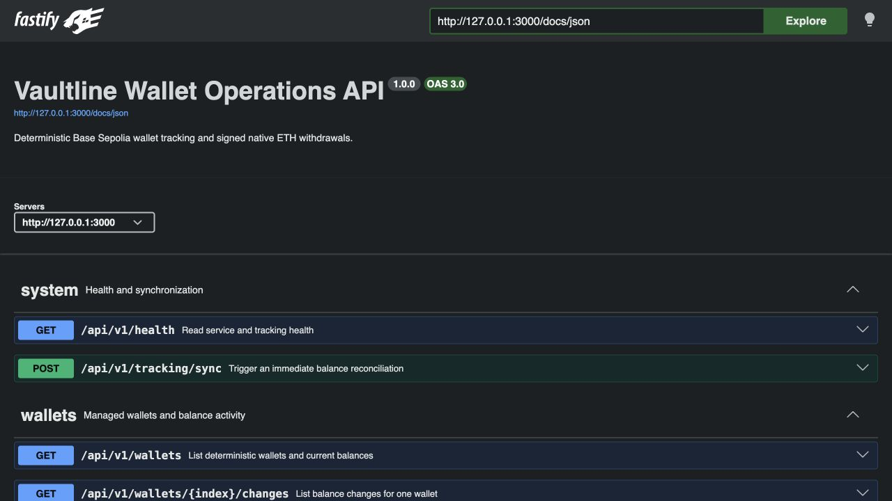
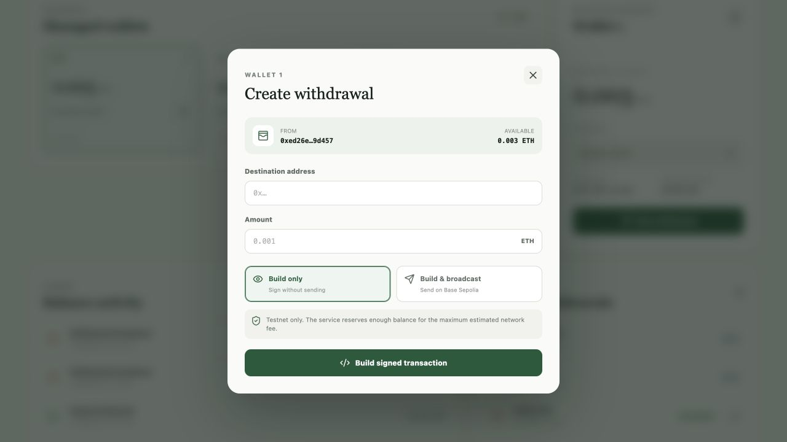
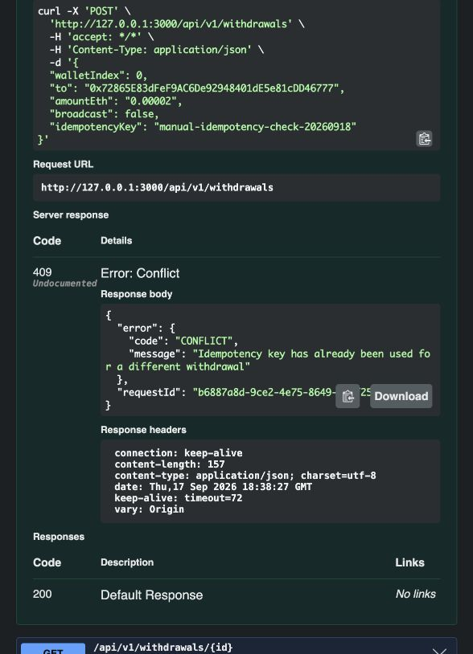

# Vaultline — Wallet Watcher and Withdrawal Builder

[](https://github.com/PrathmeshRanjan/wallet-watcher-withdrawal-builder/actions/workflows/ci.yml)


A testnet-only custody backend slice for deterministic Base Sepolia wallets. Vaultline derives indexed wallets, persists block-pinned native ETH balances, records balance activity, and builds or broadcasts signed EIP-1559 withdrawals. A responsive operations dashboard and interactive OpenAPI documentation are included.

> **Safety:** Base Sepolia only. Never use a mnemonic that controls mainnet funds. The service rejects RPC endpoints that do not report chain ID `84532`.



_The operations dashboard shows block-pinned balances, derivation order, reconciliation health, activity, and withdrawal state in one view._

## Architecture

```text
React operations dashboard
          │
          ▼
Fastify REST API ───── Withdrawal service ───── Base Sepolia JSON-RPC
          │                    │
          │             BIP-39 HD signer
          │
          ├──── Block-pinned balance tracker
          │
          ▼
SQLite (WAL) + versioned migrations
```

The API and tracker run in one process but are separate modules. This keeps the take-home easy to run while leaving a clean path to a dedicated worker and PostgreSQL in a larger deployment.

## Highlights

- Deterministic wallets at `m/44'/60'/0'/0/{index}`, with a configurable count from 1–20.
- Prefix stability: increasing the count adds indexes; decreasing it hides indexes without deleting history.
- All wallet balances are read at one exact block for a consistent snapshot.
- Immediate startup sync plus configurable 15–300 second polling; default 60 seconds.
- Lossless `bigint` handling. Wei is persisted as decimal text, never a JavaScript `number`.
- Type-2 EIP-1559 transactions with pending nonce, estimated gas plus a 20% margin, and a maximum-fee balance check.
- Build-only responses include the unsigned payload, raw signed transaction, structured signature, and precomputed hash.
- Broadcast state machine with idempotency keys, recovery of uncertain broadcasts, and receipt tracking.
- No outflow is created for a build-only withdrawal. The outflow is inserted only after an RPC broadcast succeeds or an already-broadcast hash is recovered.
- Optional bearer protection for mutating endpoints.
- React dashboard, BaseScan links, OpenAPI UI, Docker support, and deterministic tests.

## Requirements

- Node.js 24 LTS
- pnpm 11
- A Base Sepolia RPC URL. The public Base endpoint is the default; a dedicated provider is recommended for reliable testing.
- Base Sepolia ETH for any wallet used to broadcast a transaction.

## Quick start

```bash
pnpm install
pnpm run setup
pnpm dev
```

`pnpm run setup` creates a testnet-only mnemonic in `.env`, sets file permissions to `0600`, and refuses to overwrite an existing file. `.env` is ignored by Git.

Open:

- Dashboard: http://localhost:5173
- API: http://127.0.0.1:3000/api/v1
- OpenAPI UI: http://127.0.0.1:3000/docs

The Vite development server proxies `/api` and `/docs` to Fastify. In production, Fastify serves the built dashboard from the same process.

## Environment variables

| Variable                | Required | Default                    | Description                                                                          |
| ----------------------- | -------: | -------------------------- | ------------------------------------------------------------------------------------ |
| `HD_MNEMONIC`           |      Yes | —                          | Testnet-only BIP-39 mnemonic used to derive and sign all managed wallets.            |
| `BASE_SEPOLIA_RPC_URL`  |       No | `https://sepolia.base.org` | HTTP JSON-RPC endpoint. Chain ID is verified before tracking or withdrawal creation. |
| `WALLET_COUNT`          |       No | `3`                        | Active wallet count; integer from 1 through 20.                                      |
| `POLL_INTERVAL_SECONDS` |       No | `60`                       | Tracking interval; constrained to 15–300 seconds.                                    |
| `DATABASE_PATH`         |       No | `./data/wallet-watcher.db` | SQLite database path.                                                                |
| `HOST`                  |       No | `127.0.0.1`                | API bind host. Use `0.0.0.0` in a container.                                         |
| `PORT`                  |       No | `3000`                     | API port.                                                                            |
| `LOG_LEVEL`             |       No | `info`                     | Pino log level.                                                                      |
| `ADMIN_API_KEY`         |       No | —                          | When set, POST endpoints require `Authorization: Bearer …`. Minimum 12 characters.   |
| `CORS_ORIGINS`          |       No | `http://localhost:5173`    | Comma-separated allowed browser origins.                                             |

Changing `HD_MNEMONIC` while reusing a populated database is rejected because it would silently associate old history with new addresses. Use the original mnemonic or a fresh database.

## API



Interactive OpenAPI documentation is available at `http://127.0.0.1:3000/docs` while the service is running.

### List wallets

```http
GET /api/v1/wallets
```

Returns addresses, derivation paths, exact wei and formatted ETH balances, observation block metadata, freshness, and BaseScan URLs.

### Build or broadcast a withdrawal

```http
POST /api/v1/withdrawals
Content-Type: application/json
Idempotency-Key: a-client-generated-unique-value

{
  "walletIndex": 0,
  "to": "0x70997970C51812dc3A010C7d01b50e0d17dc79C8",
  "amountEth": "0.001",
  "broadcast": false
}
```

`amountEth` must be a JSON string with at most 18 decimal places. Set `broadcast` to `false` to receive a signed transaction without sending it, or `true` to submit it to Base Sepolia and record the outflow.

A previously built transaction can be broadcast with:

```http
POST /api/v1/withdrawals/{id}/broadcast
```

### Other endpoints

```text
GET  /api/v1/health
GET  /api/v1/wallets/{index}/changes
GET  /api/v1/withdrawals
GET  /api/v1/withdrawals/{id}
POST /api/v1/tracking/sync
```

If `ADMIN_API_KEY` is configured, include it on POST requests:

```http
Authorization: Bearer your-api-key
```

## Balance and deposit behavior

The tracker polls native ETH balances rather than indexing deposit transactions. On every run it first selects one current block, then reads every wallet at that block. Current balances, the block hash, block number, and observation timestamp are persisted atomically.

### Multiple deposits in one polling interval

If several deposits reach one wallet between observations, the service records one aggregate `INFLOW` equal to the positive balance difference. It intentionally does not create one record per deposit transaction or consolidate funds into another address.

### Service downtime

The database retains the last successful balance. On restart, an immediate sync compares that persisted value with the new on-chain value and records the aggregate difference. The health endpoint reports `degraded` when no successful sync has occurred in ten minutes, so an RPC outage is visible rather than silently presenting old data as current.

The first observation establishes a baseline. A non-zero first observation is labeled `INITIAL_BALANCE`, not a deposit that the service can prove occurred while it was watching.

### Limits of balance-difference tracking

Polling observes net state. Deposits and unrelated activity within the same interval may offset one another, so the system does not claim transaction-level deposit attribution. Broadcasts initiated by this service are recorded explicitly as `WITHDRAWAL_BROADCAST`. Other negative balance movements are retained as `UNCLASSIFIED_DECREASE`, not mislabeled as withdrawals.

## Withdrawal lifecycle

```text
BUILT ──broadcast accepted──► BROADCAST ──receipt status 1──► CONFIRMED
  │                              └────────receipt status 0──► REVERTED
  └────────broadcast error──────────────────────────────────► FAILED
```

The signed transaction is stored before broadcasting. Its hash is deterministic, so a startup reconciliation can detect a transaction that reached the node even if the client lost the original response. A unique withdrawal ID and optional idempotency key prevent duplicate outflow records.

## Testing

### Automated acceptance suite

Run the complete local gate from the repository root:

```bash
pnpm check
```

This runs strict type checking, 14 deterministic backend tests, and production builds for both applications. No RPC connection or testnet funds are required. For more detail:

```bash
pnpm test
pnpm test:coverage
pnpm format:check
```

Tests use a fake Base gateway and in-memory SQLite database. They do not require funds, secrets, or network connectivity. Coverage includes deterministic derivation vectors, prefix stability, database identity protection, signed-transaction recovery, 18-decimal precision, fee reservation, build-only semantics, idempotent broadcast logging, pinned-block balance reads, and aggregate inflows.

### Manual end-to-end test

Start with `pnpm dev`, then use the dashboard, Swagger UI, and a second terminal. All funds in this procedure are Base Sepolia test ETH.

#### 1. Health, UI, and API

1. Open the dashboard at `http://localhost:5173` and Swagger UI at `http://127.0.0.1:3000/docs`.
2. Confirm the dashboard reports **Base Sepolia 84532**, a healthy reconciliation, and the configured wallet count.
3. Select each wallet and verify ordered derivation paths ending in `/0`, `/1`, `/2`, and so on.
4. Click **Sync now**, then confirm the health and wallet endpoints from a terminal:

```bash
curl http://127.0.0.1:3000/api/v1/health
curl http://127.0.0.1:3000/api/v1/wallets
```

Every wallet in one response should have the same observation block number and hash.

#### 2. Deterministic wallet count

1. Record the current addresses returned by `GET /api/v1/wallets`.
2. Stop the service, set `WALLET_COUNT=5` in `.env`, and restart. The original prefix must remain unchanged and two addresses must be appended.
3. Repeat with `WALLET_COUNT=2`. Only the original first two wallets should remain active.
4. Restore the desired count and restart. Do not change `HD_MNEMONIC`.

#### 3. Deposits, polling, and persistence

1. Copy a managed address and fund it from a faucet listed in the [official Base faucet guide](https://docs.base.org/base-chain/tools/network-faucets).
2. After the transaction confirms, click **Sync now** or wait for the poll. The balance should update and activity should contain one positive `INFLOW`.
3. Inspect exact wei and activity data:

```bash
curl http://127.0.0.1:3000/api/v1/wallets
curl http://127.0.0.1:3000/api/v1/wallets/0/changes
```

4. Restart the service. The persisted balance should return and reconciliation must not duplicate the inflow.
5. To test aggregation, temporarily set `POLL_INTERVAL_SECONDS=300`, send two transfers to the same wallet before the next sync, then reconcile once. One `INFLOW` equal to the net sum should be recorded.
6. To test downtime recovery, stop the service, send a testnet deposit, wait for confirmation, and restart. Startup reconciliation should detect one aggregate inflow immediately. Restore the polling interval afterward.

#### 4. Build-only and broadcast withdrawals



1. Select a funded source wallet, click **New withdrawal**, and use another managed wallet as the destination.
2. Choose **Build only**. The result must show **Signed, not broadcast**, a hash, raw signed transaction, nonce, gas limit, and signature parity.
3. Confirm the source balance and activity did not change. `GET /api/v1/withdrawals/{id}` should report `BUILT` with `broadcastAt`, `confirmedAt`, and `actualFeeWei` set to `null`.
4. Broadcast that stored transaction with `POST /api/v1/withdrawals/{id}/broadcast`, or create a new withdrawal using **Build & broadcast**.
5. Verify the BaseScan link, one `WITHDRAWAL_BROADCAST` entry on the source, and one `INFLOW` on a managed destination.
6. After confirmation, click **Sync now**. The withdrawal should move from `BROADCAST` to `CONFIRMED` and include the actual fee and confirmation timestamp.
7. Call the broadcast endpoint again with the same ID. It must return the stored result without sending or logging a duplicate.

#### 5. Swagger validation and idempotency

Expand `POST /api/v1/withdrawals`, click **Try it out**, and begin with:

```json
{
  "walletIndex": 0,
  "to": "<another managed address>",
  "amountEth": "0.00001",
  "broadcast": false,
  "idempotencyKey": "manual-check-001"
}
```

Repeat the identical request. It must return the same withdrawal ID and hash. Reuse the key with a different amount and expect `409 CONFLICT`.

<details>
<summary>Swagger idempotency-conflict example</summary>



</details>

The following negative cases must create no withdrawal or balance activity:

| Case                               | Expected result                                 |
| ---------------------------------- | ----------------------------------------------- |
| Invalid destination                | `400 VALIDATION_ERROR`                          |
| Numeric `amountEth`                | `400`; amounts must be exact decimal strings    |
| More than 18 decimal places        | `400 VALIDATION_ERROR`                          |
| Zero amount                        | `400`; amount must be greater than zero         |
| Destination equals source          | `400`; self-transfer rejected                   |
| Amount plus maximum fee > balance  | `422 INSUFFICIENT_FUNDS` with exact wei details |
| Same idempotency key, changed body | `409 CONFLICT`                                  |
| Missing wallet                     | `404 NOT_FOUND`                                 |

#### 6. Optional API protection

Set `ADMIN_API_KEY` to a value of at least 12 characters and restart. Reads remain public, but mutations must reject missing credentials:

```bash
curl -i -X POST http://127.0.0.1:3000/api/v1/tracking/sync

curl -i -X POST \
  -H "Authorization: Bearer $ADMIN_API_KEY" \
  http://127.0.0.1:3000/api/v1/tracking/sync
```

Expect `401 UNAUTHORIZED` first and `200` with `"completed": true` second. The dashboard's **Access** control supplies the same key for UI mutations.

#### 7. Configuration guards

- `WALLET_COUNT=0` or `21` must stop startup validation; the supported range is 1–20.
- Reusing the database with a different `HD_MNEMONIC` must fail before wallet metadata is changed.
- Pointing the service at a chain other than `84532` must prevent tracking and withdrawal construction.
- `.env`, database files, raw coverage, and build output must remain untracked.

### Acceptance checklist

- [x] Deterministic, prefix-stable wallet generation
- [x] Block-pinned balance polling within the 10-minute requirement
- [x] SQLite persistence, restart reconciliation, and aggregate inflows
- [x] Build-only signed payload with no outflow
- [x] Optional broadcast, explicit outflow, receipt tracking, and recovery
- [x] Exact wei arithmetic, EIP-1559 fee reserve, and input validation
- [x] REST API, Swagger UI, responsive dashboard, Docker, CI, and tests

### Verified Base Sepolia evidence

The walkthrough above was completed end to end on Base Sepolia on 18 September 2026. The manual checks covered stable wallet derivation while changing the active count, polling and restart catch-up, aggregate inflows, build-only semantics, broadcasting, receipt reconciliation, fee reservation, idempotency, bearer authentication, and configuration guards.

One withdrawal was first built and signed without broadcasting. At that point its state was `BUILT`, its broadcast and confirmation timestamps were `null`, the source balance was unchanged, and no outflow had been recorded. The same stored payload was then broadcast through `POST /api/v1/withdrawals/{id}/broadcast` and reconciled to `CONFIRMED`:

```json
{
  "id": "84d29e23-c348-4f54-943d-24765925ff42",
  "state": "CONFIRMED",
  "network": "base-sepolia",
  "chainId": 84532,
  "from": "0xe6A65471A14B03eefb0DC952F0395966c5b79600",
  "to": "0x72865E83dFeF9AC6De92948401dE5e81cDD46777",
  "amount": { "wei": "1000000000000000", "eth": "0.001" },
  "transaction": {
    "type": 2,
    "nonce": 0,
    "gasLimit": "25200",
    "maxFeePerGas": "11000000",
    "maxPriorityFeePerGas": "1000000",
    "data": "0x"
  },
  "txHash": "0x42004aa0297c310f14064acb01e991a0f37402627fd65103d5fe4cbe2f99ef9e",
  "actualFeeWei": "139596513000",
  "broadcastAt": "2026-09-17T18:24:23.964Z",
  "confirmedAt": "2026-09-17T18:25:01.421Z"
}
```

The successful transaction is independently visible on [BaseScan](https://sepolia.basescan.org/tx/0x42004aa0297c310f14064acb01e991a0f37402627fd65103d5fe4cbe2f99ef9e). The original build-only response also contained the unsigned EIP-1559 payload, raw signed transaction, `r`/`s`/`yParity` signature, and the same deterministic transaction hash. The raw payload is omitted here because signed transactions should be treated as sensitive until mined or superseded.

During validation testing, a numeric `amountEth` exposed Fastify's default request coercion. Body coercion is now disabled and a regression test proves that amounts must remain decimal strings, preserving the exact-precision API contract.

## Docker

After creating `.env`:

```bash
docker compose up --build
```

The combined production application is served at http://localhost:3000 and SQLite data is retained in the `vaultline-data` volume.

## Security choices

- Mnemonics and private keys are never stored in SQLite, returned from APIs, or logged.
- `.env`, SQLite files, build output, and coverage files are ignored by Git.
- Signing occurs locally with a key derived only when needed.
- The RPC chain ID is pinned to Base Sepolia.
- Signed raw transactions authorize one exact transfer but remain sensitive until mined or superseded; API access should be protected outside local development.
- The API binds to loopback by default and supports optional bearer authentication for all mutation routes.
- This repository and its generated credentials are for testnet use only.

## Project structure

```text
apps/
  api/  Fastify API, wallet derivation, tracking, signing, persistence, tests
  web/  React operations dashboard
```

## Deliberate trade-offs

- SQLite is appropriate for 1–20 wallets and a single service instance. Multi-instance operation would use PostgreSQL plus a distributed polling lock.
- Polling is the source of truth. Webhooks would improve latency but add provider coupling, public callback infrastructure, duplicate delivery, and catch-up logic without eliminating reconciliation.
- Native ETH keeps the assignment to one asset. ERC-20 support would also require ETH gas management.
- The in-process per-wallet lock prevents concurrent nonce selection in this service instance. A distributed deployment would use database-backed nonce reservation.
